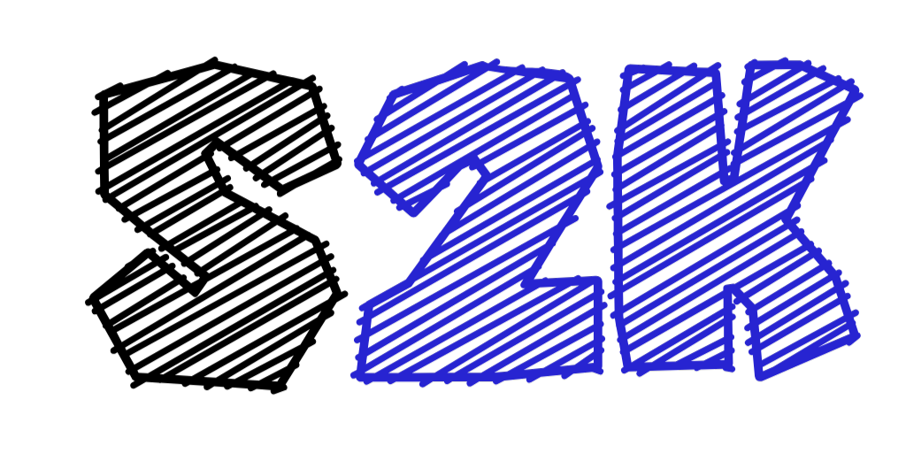
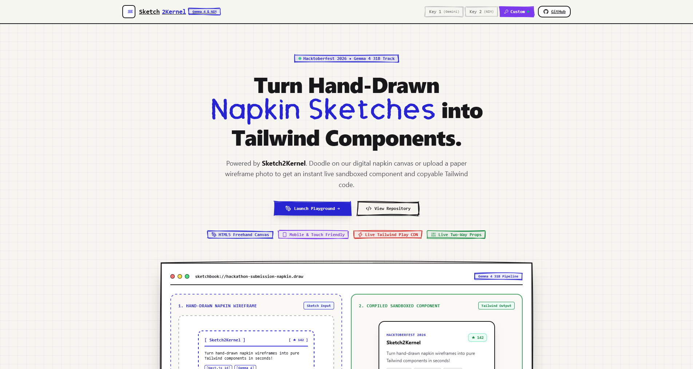
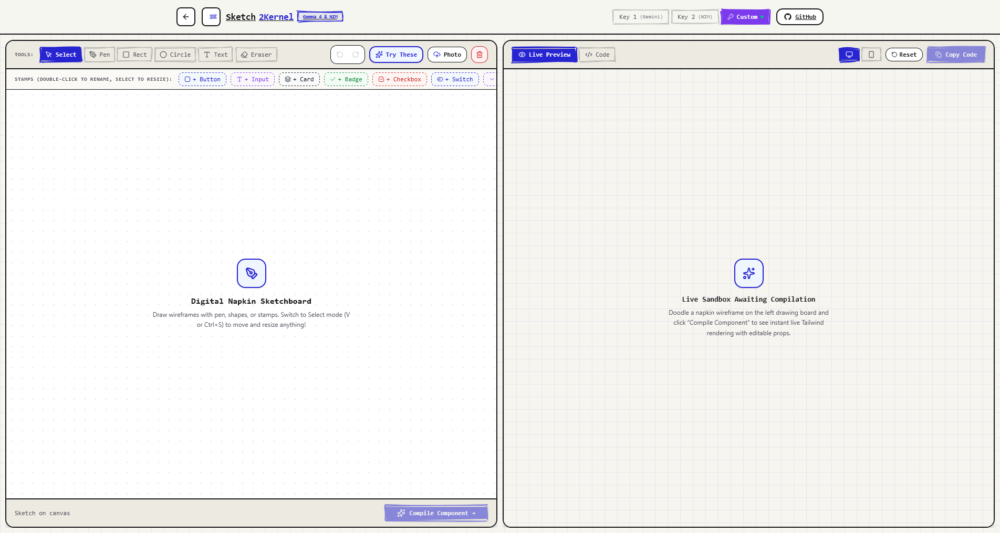
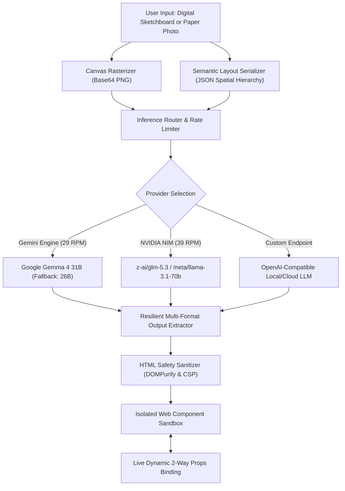
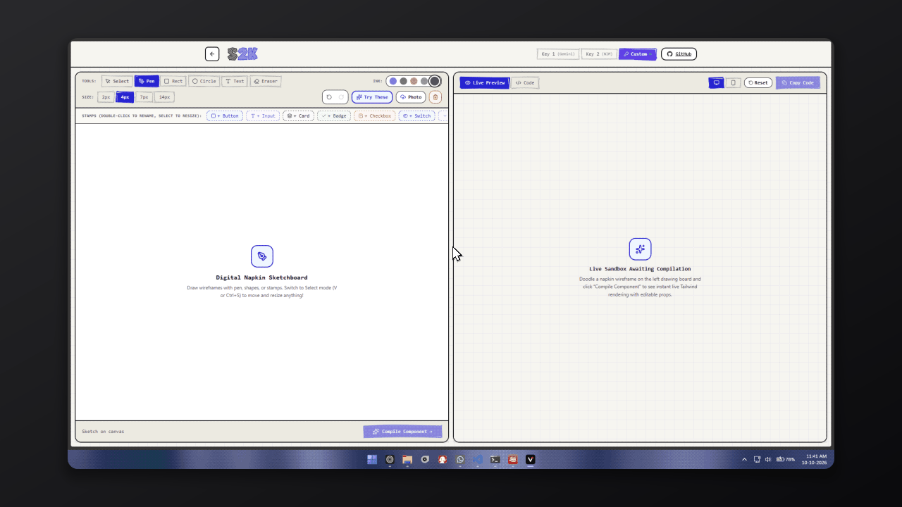

<p align="center">
  
</p>

<h1 align="center">Sketch2Kernel</h1>

<p align="center">
  <strong>The AI-Powered Digital Sketchbook: Compile Hand-Drawn Napkin Wireframes into Semantic, Sandboxed Web Components in Seconds.</strong>
</p>

<p align="center">
  <a href="https://nextjs.org"></a>
  <a href="https://react.dev"></a>
  <a href="https://developer.mozilla.org/en-US/docs/Web/API/Web_components"></a>
  <a href="https://deepmind.google/technologies/gemma/"></a>
  <a href="https://build.nvidia.com"></a>
  <a href="https://roughjs.com"></a>
  <a href="https://vitest.dev"></a>
  <a href="LICENSE"></a>
</p>

<p align="center">
  <a href="#demonstration">Demonstration</a> &bull;
  <a href="#the-vision-and-philosophy">Vision</a> &bull;
  <a href="#system-architecture-and-data-flow">Architecture</a> &bull;
  <a href="#multi-engine-ai-orchestration">AI Engines</a> &bull;
  <a href="#sliding-window-rate-limiters">Rate Limiters</a> &bull;
  <a href="#digital-napkin-sketchboard">Canvas Suite</a> &bull;
  <a href="#live-sandboxed-runner">Live Sandbox</a> &bull;
  <a href="#security-and-sanitization">Security</a> &bull;
  <a href="#getting-started">Getting Started</a>
</p>

---

## Demonstration

<p align="center">
  
</p>

<p align="center">
  
</p>

---

## The Vision and Philosophy

Every breakthrough product starts the exact same way: sketched hurriedly on a coffee shop napkin, a notebook margin, or a conference whiteboard.

Traditional UI builders force creators into rigid, sterile layout trees and form inputs before their concepts have matured. **Sketch2Kernel** bridges the gap between raw, tactile human ideation and production-ready frontend code.

Instead of presenting another generic SaaS form, Sketch2Kernel is engineered as an **authentic interactive digital sketchbook**:
- **Rough.js Vector Rendering**: Hand-sketched vector borders, buttons, tabs, and panels drawn dynamically with tactile pen physics.
- **Dynamic Pen Strokes**: Interactive buttons and controls that physically re-sketch their rough strokes on mouse hover.
- **Notebook Paper Textures**: Authentic notebook paper grids and dot matrices designed for natural wireframing.
- **60fps Fluid Performance**: Hardware-accelerated drawing and transform pipelines ensuring zero input lag on desktop, Apple Pencil, or mobile touch.

---

## System Architecture and Data Flow

Sketch2Kernel pairs multimodal computer vision with semantic spatial layout serialization, feeding a resilient multi-model pipeline that validates, sanitizes, and renders live sandboxed components.



---

## Key Capabilities

### 1. Digital Napkin Sketchboard

<p align="center">
  
</p>

- **Continuous 60fps Freehand Pen**: Low-latency drawing engine with ballpoint blue, carbon black, crimson red, and forest green ink palettes, complete with variable stroke widths.
- **Interactive Geometric Shapes**: Draw Rectangles and Circles with **8-point precision resize handles** (NW, N, NE, E, SE, S, SW, W) and border/body movement.
- **Pre-Made UI Component Stamps**: Stamp editable Buttons, Input fields, Card containers, Badges, Checkboxes, Toggle switches, Dropdowns, Tables, and Navbars.
  - *In-Place Renaming*: Double-click any stamp to immediately edit its label text.
  - *8-Point Resizing*: Scale and adjust stamp proportions via interactive handles.
- **Scalable Draggable Text**: Place text labels and titles, and drag diagonally from corner handles to scale font sizes smoothly.
- **Precision Eradicator Mode**: Geometrical point-to-line-segment collision targeting that removes **only the single touched stroke** without deleting crossing or connected strokes.
- **Comprehensive Multi-Layer History**: Deep snapshot state history tracking pen strokes, shapes, stamps, text items, and canvas pixels.
- **Paper Photo Upload**: Upload photographs or scans of actual paper napkins and physical drawings directly onto the canvas.
- **Curated Napkin Presets**: Built-in library of napkin wireframe presets (Hero Section, Pricing Table, Auth Card, Dashboard, and Data Grid).

#### Canvas Tools and Keyboard Shortcuts

| Tool / Action | Shortcut | Description |
|---|---|---|
| Select / Move | `V` or `Ctrl+S` | Select, drag, and resize shapes, stamps, and text items |
| Freehand Pen | `P` | Draw freehand ink strokes with chosen color and stroke width |
| Rectangle | `R` | Create resizable rectangular frames and containers |
| Circle | `C` | Create resizable circle badges, avatars, and icons |
| Text Tool | `T` | Add editable, scalable text labels |
| Eraser Tool | `E` | Delete specific touched strokes with line-segment precision |
| Undo | `Ctrl+Z` / `Cmd+Z` | Step back through drawing and element mutations |
| Redo | `Ctrl+Y` / `Ctrl+Shift+Z` | Step forward through reverted state snapshots |
| Delete Element | `Delete` / `Backspace` | Remove selected shape, stamp, or text item |
| In-Place Edit | Double Click | Edit stamp label or text content directly |

---

### 2. Multi-Engine AI Orchestration

<p align="center">
  
</p>

Sketch2Kernel provides three independent compilation engines with separated credential management and dedicated model configuration:

#### Engine 1: Google Gemini (Native Hacktoberfest Track)
- **Direct Visual Synthesis**: Processes raw base64 canvas imagery directly using `@google/genai` and `gemma-4-31b-it`.
- **Dynamic Redundancy**: Automatically falls back to `gemma-4-26b-a4b-it` if primary model quota or limits are reached, ensuring non-stop uptime.
- **Sliding-Window Protection**: Client-side **29 RPM sliding-window rate limiter** (`lib/gemini-rate-limiter.ts`) prevents accidental upstream quota exhaustion.

#### Engine 2: NVIDIA NIM (High-Throughput Acceleration)
- **Sub-2-Second Accelerated Generation**: High-throughput endpoints powered by `z-ai/glm-5.3` and `z-ai/glm-5.3-flash`.
- **Thinking Parameter Controls**: Configurable thinking toggle (`enable_thinking: false`) for models that support explicit reasoning parameters.
- **Canvas Semantic Layout Serializer**: Automatically serializes canvas shapes, component stamps, text labels, dimensions, and layout hierarchy into an inventory. Non-vision models receive exact spatial context, preventing hallucinations.
- **Sliding-Window Protection**: Hardware-level **39 RPM sliding-window rate limiter** (`lib/nvidia-rate-limiter.ts`) ensures compliance with NVIDIA developer tier constraints.

#### Engine 3: Custom OpenAI-Compatible Endpoints
- **Universal Provider Support**: Connect any local or remote OpenAI-compatible endpoint (Ollama, vLLM, OpenRouter, Groq, Together).
- **Custom Configuration**: Configure custom endpoint URL, model identifier, and private API key directly in the navigation modal.
- **Clean Request Payloads**: Adheres strictly to standard OpenAI chat completion schemas without non-standard extra parameters.

---

### 3. Sliding-Window Rate Limiters

To guarantee reliability across free-tier developer keys and prevent `429 Too Many Requests` lockouts, Sketch2Kernel includes sliding-window rate limiting implementations:

```typescript
// Rolling sliding-window rate limiting mechanism
const windowMs = 60 * 1000; // 60-second window
// Gemini: 29 requests per minute
// NVIDIA NIM: 39 requests per minute
```

- **Timestamp Queue**: Each dispatch logs a timestamp in an in-memory queue. Timestamps older than 60 seconds are purged automatically.
- **Proactive Queuing**: When threshold limits are approached, subsequent requests are automatically held and delayed until the earliest timestamp exits the window.
- **Zero Server Crashes**: Upstream rate limit penalties are avoided before outgoing HTTP requests leave the client or server.

---

### 4. Resilient Multi-Format Output Extractor

Large language models return code in varied formats depending on prompt dynamics and model architecture. Sketch2Kernel includes a multi-stage parser in `lib/json-extractor.ts`:
- **Pure JSON & Fenced Blocks**: Standard `{ componentName, html, props }` parsing.
- **Syntax Repair**: Automatically heals unescaped newlines, tabs, and unescaped double quotes inside HTML attributes.
- **Markdown HTML Blocks**: Recovers pure HTML from fenced markdown code blocks.
- **Git/Diff Patches**: Extracts and reconstructs component markup from git diff patches and `+` line additions.
- **Raw HTML Extraction**: Recovers outer HTML elements from conversational model commentary.
- **Automatic Prop Synthesis**: Intelligently derives interactive component props from template tokens (`{{propName}}`) or DOM elements when props are omitted by the model.

---

### 5. Live Interactive Sandbox Runner

<p align="center">
  
</p>

- **Isolated Component Sandbox**: Renders compiled Web Components inside an isolated iframe with live CSS and styling execution.
- **Real-Time Two-Way Props Table**:
  - Automatically identifies customizable component properties (labels, titles, button text, style variants, colors).
  - **Live Binding**: Editing any prop value in the table immediately re-interpolates the HTML and updates the live preview in real time without triggering an AI re-compilation.
- **Viewport Switcher**: Instantly toggle between **Desktop (100%)**, **Tablet**, and **Mobile (375px)** responsive previews.
- **One-Click Code Export**: View clean, formatted Web Component HTML markup and copy it to your clipboard with celebratory particle effects.
- **Responsive Drawer**: On mobile devices and small screens, the sandbox slides out cleanly as a drawer upon compilation.

---

### 6. Security and Sanitization

Security is treated as a fundamental architectural pillar:
- **HTML Sanitization**: All AI-synthesized markup passes through `sanitize-html` and `DOMPurify` before entering the DOM or iframe.
- **Script and Event Elimination**: Proactively strips `<script>`, `<object>`, `<embed>`, `onload`, `onerror`, `onclick`, and `javascript:` URIs.
- **Iframe Sandboxing**: Sandbox runners are isolated with restricted permission sets (`sandbox="allow-scripts allow-modals"`), preventing parent window hijacking, unauthorized storage access, or cookie tampering.

---

## Project Structure

```
sketch-to-kernel/
├── app/
│   ├── api/
│   │   └── compile/
│   │       └── route.ts              # Unified AI compilation endpoint
│   ├── playground/
│   │   └── page.tsx                  # Edge-to-edge workbench (Canvas & Sandbox)
│   ├── favicon.ico                   # Application favicon
│   ├── globals.css                   # Sketchbook theme, fonts, 60fps GPU acceleration
│   ├── layout.tsx                    # Root layout, metadata, icon links
│   └── page.tsx                      # Landing page, provider showcase, and demo gallery
├── assets/                           # High-resolution logos, demo GIFs, and screenshots
│   ├── logo.png                      # Official Sketch2Kernel brand logo
│   ├── demo-overview.gif             # Full pipeline demonstration GIF
│   ├── demo-canvas.gif               # Canvas drawing and stamp demonstration GIF
│   ├── demo-compilation.gif          # Multi-provider compilation GIF
│   ├── demo-sandbox.gif              # Sandbox and live props demonstration GIF
│   └── README.md                     # Asset drop-in instructions
├── components/
│   ├── canvas-panel.tsx              # Digital canvas: shapes, stamps, pen, eraser, shortcuts
│   ├── canvas-presets.ts             # Built-in napkin wireframe presets
│   ├── code-viewer.tsx               # Clean HTML and Web Component code viewer
│   ├── ink-blob-transition.tsx       # Hand-drawn ink blob page transitions
│   ├── navbar.tsx                    # Brand header, multi-provider credential modal
│   ├── props-table.tsx               # Real-time two-way prop synchronization table
│   ├── sandbox-panel.tsx             # Live component preview and isolated runner
│   └── sketch-ui.tsx                 # Rough.js vector UI components and cards
├── lib/
│   ├── custom-endpoint.ts            # Custom OpenAI-compatible endpoint client
│   ├── gemini-rate-limiter.ts        # 29 RPM sliding-window rate limiter for Gemini
│   ├── json-extractor.ts             # Resilient multi-format HTML/JSON extractor
│   ├── nvidia-nim.ts                 # NVIDIA NIM inference client
│   ├── nvidia-rate-limiter.ts        # 39 RPM sliding-window rate limiter for NVIDIA
│   ├── sanitizer.ts                  # XSS and HTML safety sanitizer
│   ├── schemas.ts                    # Zod validation schemas
│   ├── types.ts                      # Shared TypeScript definitions
│   └── utils.ts                      # Local storage and helper utilities
├── public/
│   ├── logo.png                      # Web-accessible brand logo
│   ├── assets/                       # Public directory for landing showcase media
│   └── fonts/
│       └── DrawablyPen.ttf           # Hand-drawn sketchbook typography
└── tests/
    ├── api-helpers.test.ts           # Route handler and fallback tests
    ├── lib.test.ts                   # Serialization and parser tests
    └── sanitizer.test.ts             # XSS prevention and sanitization tests
```

---

## Getting Started

### Prerequisites

- Node.js 18.17 or higher
- npm or pnpm

### Installation

1. Clone the repository:
   ```bash
   git clone https://github.com/Pierce05/sketch-to-kernel.git
   cd sketch-to-kernel
   ```

2. Install dependencies:
   ```bash
   npm install
   ```

3. Configure environment variables (optional for local deployment):
   Create a `.env.local` file in the project root:
   ```env
   # Google Gemini API Keys
   GEMINI_API_KEY_1=your_gemini_api_key_here
   GEMINI_API_KEY_2=optional_backup_gemini_api_key

   # NVIDIA NIM API Keys
   NVIDIA_API_KEY_1=your_nvidia_nim_api_key_here
   NVIDIA_API_KEY_2=optional_backup_nvidia_api_key

   # Custom Endpoint (Optional Default)
   CUSTOM_ENDPOINT_URL=https://api.openai.com/v1/chat/completions
   CUSTOM_ENDPOINT_KEY=optional_custom_key
   CUSTOM_ENDPOINT_MODEL=gpt-4o
   ```
   *Note: Users can also input their own private API keys directly in the web UI without configuring environment variables.*

4. Launch the local development server:
   ```bash
   npm run dev
   ```
   Navigate to `http://localhost:3000` in your browser.

5. Run automated test suites:
   ```bash
   npm test
   ```

6. Build for production:
   ```bash
   npm run build
   ```

---

## Technical Specifications

| Category | Specification |
|---|---|
| Frontend Framework | Next.js 16.4 (App Router, Turbopack) |
| UI Library | React 19.3 |
| Component Output | Semantic HTML5 & Modern Responsive Web Components |
| Vector Engine | Rough.js vector SVG rendering |
| Multimodal AI Models | Google Gemma 4 31B (`gemma-4-31b-it`), Gemma 4 26B (`gemma-4-26b-a4b-it`) |
| NIM Accelerated Models | `z-ai/glm-5.3`, `z-ai/glm-5.3-flash` |
| Custom Model Support | OpenAI Chat Completions compatible (Ollama, vLLM, OpenRouter, Groq) |
| Rate Limiting | 29 RPM (Gemini) / 39 RPM (NVIDIA NIM) sliding-window queues |
| Validation & Schema | Zod v3 |
| Security Pipeline | sanitize-html, DOMPurify, Content Security Policy |
| Test Coverage | Vitest (45 automated test cases across 3 suites) |
| Target Browsers | Modern Evergreen Browsers (Chrome, Edge, Firefox, Safari) |

---

## Verification and Quality Assurance

Every pull request is automatically verified against a continuous integration pipeline:
- **TypeScript**: Strict typechecking (`tsc --noEmit`) with zero unresolved types.
- **ESLint**: Zero lint warnings or errors.
- **Vitest**: 45 passing automated unit and integration tests covering API fallback orchestration, rate limiting, layout serialization, JSON extraction, and XSS sanitization.
- **Production Build**: Production compilation verified using Next.js Turbopack.

---

## License

This project is licensed under the [MIT License](LICENSE).